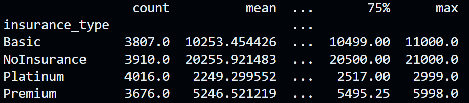

# Summary of Q1
Total number of visits: 15409 
First few rows of file: 
patient_id,visit_date,age,education_level,walking_speed 
P0001,2020-01-19,66.33,Bachelors,3.51 
P0001,2020-05-02,66.62,Bachelors,3.55 
P0001,2020-07-25,66.85,Bachelors,3.47 
P0001,2020-10-21,67.09,Bachelors,3.93 
P0001,2021-01-28,67.36,Bachelors,3.21 
P0001,2021-04-22,67.59,Bachelors,3.81 
P0001,2021-07-12,67.81,Bachelors,3.37 
P0001,2021-10-24,68.1,Bachelors,3.67 
P0001,2022-04-21,68.59,Bachelors,2.93 
# Summary of Q2
Mean walking speed by education level: 
Bachelors       4.051125 
Graduate        4.447184 
High School     3.244856 
Some College    3.728234 
 
Mean costs by insurance type: 
Basic          10253.454426 
NoInsurance    20255.921483 
Platinum        2249.299552 
Premium         5246.521219 
 
Age effect on walking speed: -0.69 
# Summary of Q3
## Analyze walking speed
Model: OLS
Regression Coefficients: [ 0.19970344  0.5923656  -0.59814054 -0.1939285  -0.03021663] 
R2: 0.808 
RMSE for Baseline Model: 0.34 
F-statistic: 1673951.77 
P-value: 0.0000 
## Analyze costs
Simple analysis of insurance type effect 
 
Box plots and basic statistics 
 
Effect sizes using eta-squared: 0.9969, which means insurance type has a **strong** effect on costs 
## Advanced analysis
 
Analyze _education_ and _age_ interaction effects on _walking speed_. Control for relevant confounders _visit months_